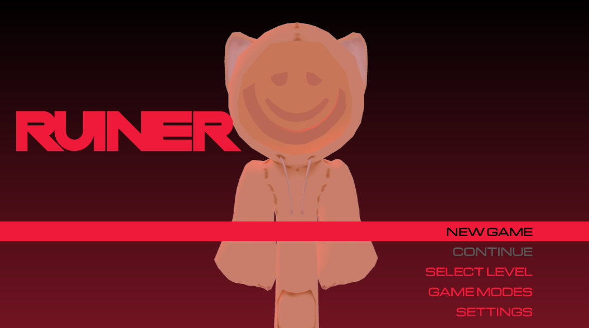

<h1 align="center">Ruiner</h1>

[](https://github.com/kareu-uu/Ruiner-Ui/releases/tag/ui-ux-release)

A modern Ui with nice red tones, should be used as the main Menu of your game. Called 'Ruiner', this project was officially launched in 12/31/2023 taking approximately 9 days of work to put together its main style and another 2 days programming and creating life for it

## 🔥 Announcement

[]()

_Check the oficial video for a detailed preview from the project_

## 💡 Features

- Insane & beautiful color palletes
- Compatibility w/ Keyboard to navigate through buttons
- 3D Preview of your char in the background
- Basic animations (char included)

## 📸 Screenshots

_See the screenshots below:_



## ⤵ Installing..

First, this is a Ui project developed in [Roblox Studio](https://create.roblox.com/docs/tutorials/first-experience)'s engine, them, all of the project is in the `.rbxm` file on the first page of this repo.

Download the file from "Releases" page or directly on this repo (not recommended):

1. Acess the first page of the repo -> go to section "Releases" -> click on the release you want:
   

1. After redirect, click on the link especified in the notes of the release them download the `.zip` file:
   

1. Open your studio, then enter on a place, go to `StarterGui` -> \*_right mouse click_ -> `Insert From File..`, select the `.rbxm` file:
   

---

```
no CMD or especial commands are required to install this project
```

## ⌨ Usage

- Keyboard:

  - Enter on a especified window: `Enter`
  - Navigate up: `Arrow Up`
  - Navigate down: `Arrow Down`

> _this is a basic demo, the usage tutorial is propositely simple_

## 👨🏻‍💻 Contribution

_currently non-contributable project_

## 📄 License & Source Code

### License:

> This project has been inspired in a unoficial game on Internet, anything assets that is not my property are inserted in this repo files. For issues contact my professional email: `kareudeveloper@gmail.com`
